<p align="center">
  
</p>

<br/>

<p align="center">
  
</p>
<p align="center">
  <sub>↑ &nbsp; what actually happens every time you send a message</sub>
</p>

<br/>

<p align="center">
  
  &nbsp;
  
  &nbsp;
  
  &nbsp;
  
  &nbsp;
  
  &nbsp;
  
</p>

<h3 align="center">
  You upload a PDF. You ask a question.<br/>
  Cortex RAG retrieves, cross-checks, reasons, and cites — entirely on your machine.<br/>
  <sub>No API key &nbsp;·&nbsp; No cloud upload &nbsp;·&nbsp; No subscription</sub>
</h3>

<br/>

---

<br/>

<h2 align="center">✦ &nbsp; Nine Techniques &nbsp; ✦</h2>

<br/>

<table>
<tr>
<td align="center" valign="top" width="33%">
<br/>
<b>🧬 &nbsp; Contextual Retrieval</b>
<br/><br/>
<sub>LLM prepends situating context to every chunk <i>before</i> indexing. Each vector carries the full document story, not just a fragment.</sub>
<br/><br/>
</td>
<td align="center" valign="top" width="33%">
<br/>
<b>🔀 &nbsp; RAG-Fusion + RRF</b>
<br/><br/>
<sub>Generates N query variants, retrieves independently for each, then merges all ranked lists via Reciprocal Rank Fusion for better recall.</sub>
<br/><br/>
</td>
<td align="center" valign="top" width="33%">
<br/>
<b>🕸️ &nbsp; GraphRAG</b>
<br/><br/>
<sub>Builds a NetworkX knowledge graph over document entities. Retrieves relational context that a pure vector search would miss entirely.</sub>
<br/><br/>
</td>
</tr>
<tr>
<td align="center" valign="top">
<br/>
<b>✅ &nbsp; Corrective RAG (CRAG)</b>
<br/><br/>
<sub>LLM grades every retrieved chunk for relevance. Noise is silently dropped before the answer is generated. The model only sees what matters.</sub>
<br/><br/>
</td>
<td align="center" valign="top">
<br/>
<b>⚡ &nbsp; Neural Reranking</b>
<br/><br/>
<sub>A Cross-Encoder (ms-marco-MiniLM) reorders all retrieval candidates by true query–passage relevance score, not just embedding similarity.</sub>
<br/><br/>
</td>
<td align="center" valign="top">
<br/>
<b>🔭 &nbsp; HyDE</b>
<br/><br/>
<sub>Generates a hypothetical answer first to expand sparse queries into a richer dense embedding space before the actual retrieval step.</sub>
<br/><br/>
</td>
</tr>
<tr>
<td align="center" valign="top">
<br/>
<b>🧠 &nbsp; Live Reasoning Panel</b>
<br/><br/>
<sub>Streams the model's <code>&lt;think&gt;</code> chain-of-thought in real time. Watch it reason through your documents before the answer appears.</sub>
<br/><br/>
</td>
<td align="center" valign="top">
<br/>
<b>💾 &nbsp; Semantic Cache</b>
<br/><br/>
<sub>Cosine-similarity cache at threshold 0.92 on query embeddings. Repeat questions skip retrieval and generation entirely — answer is instant.</sub>
<br/><br/>
</td>
<td align="center" valign="top">
<br/>
<b>💬 &nbsp; Chat Memory</b>
<br/><br/>
<sub>Full multi-turn conversation history flows into every generation call. Ask follow-ups naturally; the model remembers what you discussed.</sub>
<br/><br/>
</td>
</tr>
</table>

<br/>

---

<br/>

<h2 align="center">⟁ &nbsp; How a query flows through the system</h2>

<br/>

```
Upload (PDF / DOCX / TXT)
 │
 ├── Chunk documents
 │
 └── [Contextual Retrieval ON]──► LLM enriches each chunk with surrounding context
                                         │
                                         ▼
                     ┌──────────────────────────────────┐
                     │   BM25   ·   FAISS   ·   Graph   │  ← three indexes built
                     └──────────────────────────────────┘
                                         │
                                   Query arrives
                                         │
                         ┌───────────────┴───────────────┐
                         ▼                               ▼
                  💾 Semantic Cache?              🔀 RAG-Fusion
                  ┌── HIT → return instantly       multi-query expansion
                  │   MISS ↓                            │
                  │                              RRF merge of results
                  │                            + GraphRAG entity boost
                  │                                     │
                  │                            ⚡ Neural Rerank (CrossEncoder)
                  │                                     │
                  │                            ✅ CRAG: grade each chunk
                  │                               drop irrelevant ones
                  │                                     │
                  │                            🧠 LLM stream
                  │                               <think> panel live
                  │                                     │
                  └─────────────────────────────► Answer + Source cards
```

<br/>

---

<br/>

<h2 align="center">⚡ &nbsp; Quick Start</h2>

<br/>

**Before you begin:**

- [ ] [Ollama](https://ollama.com/) installed and running
- [ ] Python 3.10 or higher available

<br/>

**1 &nbsp;—&nbsp; Clone**

```bash
git clone https://github.com/SaiAkhil066/DeepSeek-RAG-Chatbot.git
cd DeepSeek-RAG-Chatbot
```

**2 &nbsp;—&nbsp; Install**

```bash
pip install -r requirements.txt
```

> **Windows only:** if you get a `c10.dll` DLL error on first run, pin PyTorch to the stable CPU build:
> ```bash
> pip uninstall torch -y
> pip install "torch==2.1.2" --index-url https://download.pytorch.org/whl/cpu
> ```

**3 &nbsp;—&nbsp; Pull models**

```bash
ollama pull llama3.1:8b          # LLM  (swap for any model you prefer)
ollama pull nomic-embed-text     # Embeddings  (required)
```

**4 &nbsp;—&nbsp; Run**

```bash
python -m streamlit run app.py
```

Open **http://localhost:8501**

> Use `python -m streamlit run` (not bare `streamlit run`) to ensure the correct Python environment is picked up.

<br/>

---

<br/>

<h2 align="center">🤖 &nbsp; Works with any Ollama model</h2>

<br/>

The model selector in the sidebar auto-populates from your locally installed Ollama models. Swap freely — no config change needed.

<br/>

| Model | Params | Speed | Notes |
|---|---|---|---|
| `llama3.1:8b` | 8B | ⚡⚡⚡ | Default · best all-round balance |
| `qwen2.5:7b` | 7B | ⚡⚡⚡ | Strong on multilingual documents |
| `mistral:7b` | 7B | ⚡⚡⚡ | Fast, great for long documents |
| `llama3.1:70b` | 70B | ⚡ | Best quality when speed isn't priority |
| `qwen2.5-coder:7b` | 7B | ⚡⚡⚡ | Best for code / technical docs |

<br/>

---

<br/>

<details>
<summary><b>🐳 &nbsp; Docker setup</b></summary>

<br/>

**Option A — Ollama on host (recommended)**

```bash
docker-compose build && docker-compose up
```

Ollama runs natively; the container connects via the host network.

<br/>

**Option B — Everything in Docker**

```yaml
version: "3.8"
services:
  ollama:
    image: ghcr.io/jmorganca/ollama:latest
    ports:
      - "11434:11434"

  cortex-rag-service:
    build: .
    ports:
      - "8501:8501"
    environment:
      - OLLAMA_API_URL=http://ollama:11434
      - MODEL=llama3.1:8b
      - EMBEDDINGS_MODEL=nomic-embed-text:latest
      - CROSS_ENCODER_MODEL=cross-encoder/ms-marco-MiniLM-L-6-v2
    depends_on:
      - ollama
```

```bash
docker-compose up
```

</details>

<br/>

---

<br/>

<h2 align="center">🔩 &nbsp; Tech Stack</h2>

<br/>

<table>
<tr>
<td><b>UI</b></td><td>Streamlit 1.30</td>
<td><b>LLM inference</b></td><td>Ollama (local)</td>
</tr>
<tr>
<td><b>Vector store</b></td><td>FAISS</td>
<td><b>Sparse retrieval</b></td><td>BM25 (rank-bm25)</td>
</tr>
<tr>
<td><b>Knowledge graph</b></td><td>NetworkX</td>
<td><b>Neural reranker</b></td><td>sentence-transformers CrossEncoder</td>
</tr>
<tr>
<td><b>Embeddings</b></td><td>nomic-embed-text via Ollama</td>
<td><b>RAG orchestration</b></td><td>LangChain + langchain-classic</td>
</tr>
<tr>
<td><b>Document loading</b></td><td>PyMuPDF · Docx2txt · TextLoader</td>
<td><b>Supported files</b></td><td>PDF · DOCX · TXT · MD</td>
</tr>
</table>

<br/>

---

<br/>

<p align="center">
  Built with curiosity &nbsp;·&nbsp; runs on your machine &nbsp;·&nbsp; owned by you
  <br/><br/>
  <a href="https://www.reddit.com/user/akhilpanja/">Reddit</a>
  &nbsp;·&nbsp;
  <a href="https://github.com/SaiAkhil066/DeepSeek-RAG-Chatbot/issues">Issues</a>
  &nbsp;·&nbsp;
  <a href="https://github.com/SaiAkhil066/DeepSeek-RAG-Chatbot/pulls">Pull Requests</a>
  <br/><br/>
  <sub><i>The future of retrieval-augmented AI is local — no internet required.</i></sub>
</p>
